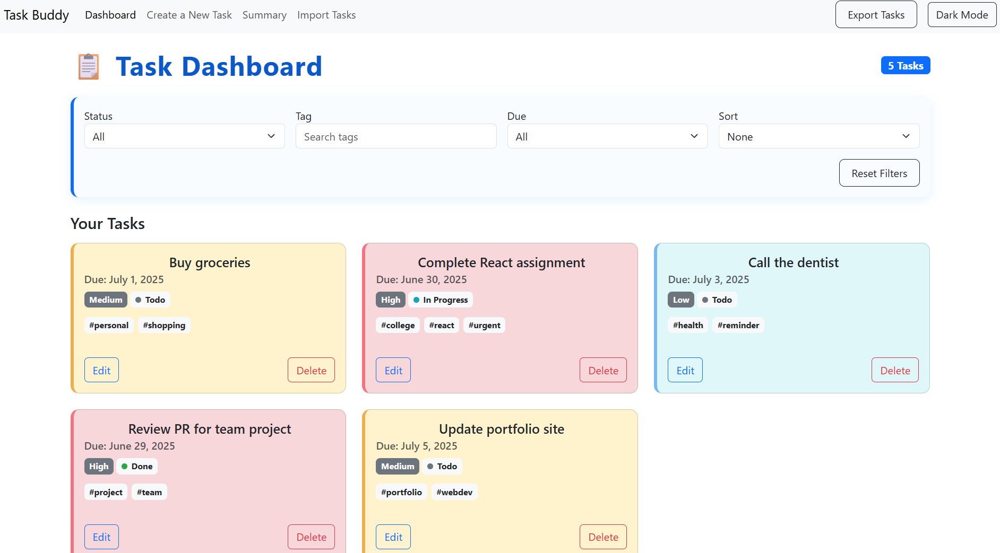

# TaskBuddy 📝

**TaskBuddy** is a powerful, easy-to-use task management web application built using **Next.js**. It lets you create, edit, delete, import, export, and organize your tasks with a smooth and responsive UI. All your task data is stored in the browser via `localStorage` to ensure persistence across sessions.

🔗 **Live Demo**: [https://taskbuddy-seven-wheat.vercel.app/](https://taskbuddy-seven-wheat.vercel.app/)

---

## 🚀 Features

### ✅ Task Creation
- Add new tasks with:
  - **Title**
  - **Description**
  - **Due Date**
  - **Priority** (Low / Medium / High)
  - **Tags** (comma-separated)
  - **Status** (Todo / In Progress / Done)

### 🛠 Task Management
- View tasks in **grid** layout
- Edit or delete tasks
- Update task status seamlessly

### 🔍 Filtering & Sorting
- **Filter by:**
  - Status
  - Tags
  - Due Date (Today / This Week)
- **Sort by:**
  - Due Date
  - Priority
  - Creation Date

### 📊 Summary Page
- View:
  - Total pending tasks for the week
  - Task distribution by priority
  - Task distribution by Status

### 💾 Data Persistence
- All data is stored in `localStorage`
- Application state persists across page reloads

### 🌓 Dark Mode
- Toggle dark/light theme with smooth transition

---

## 🧭 Available Routes

| Route              | Description                         |
|-------------------|-------------------------------------|
| `/`               | Dashboard - view all tasks          |
| `/create`         | Create a new task                   |
| `/edit/[id]`      | Edit a specific task                |
| `/task/[id]`      | Detailed view of a task             |
| `/summary`        | Summary of tasks                    |
| `/import`         | Import tasks via JSON               |

---

## 🛠 Tech Stack

- **Framework**: [Next.js](https://nextjs.org/)
- **Styling**: [Bootstrap](https://getbootstrap.com/) + Custom CSS
- **State & Storage**: React Hooks + localStorage

---

## 📦 Running Locally

1. Clone the repo:
   ```bash
   git clone https://github.com/your-username/taskbuddy.git
   cd taskbuddy
2. Install dependencies:
   ```bash
   npm install
3. Run the development server:
   ```bash
   npm run dev
4. Open your browser at http://localhost:3000


## Export and Import Tasks
- **Export**: Save all your tasks as a downloadable JSON file
- **Import**: Load tasks from a previously exported JSON file


